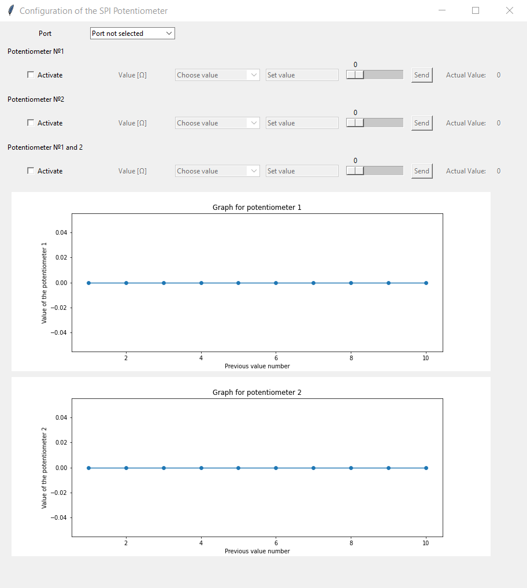

# Aplication for controlling digital potentiometer by spi interface

The aim of this project was creating an application with which you can control an integrated circuit, which consists of two potentiometers.
This solution helps to change the parameter of an electronic element remotely.

  

To start working with this app you need to choose COM-port and element control option (first potentiometer, second potentiometer, two potentiometers at once). 
Also you need to upload the program (from the project directory) to the Arduino microcontroller.

Of course, you also need to make the appropriate wire connections, connect the appropriate pins of the integrated circuit with the pins of the Arduino microcontroller.
